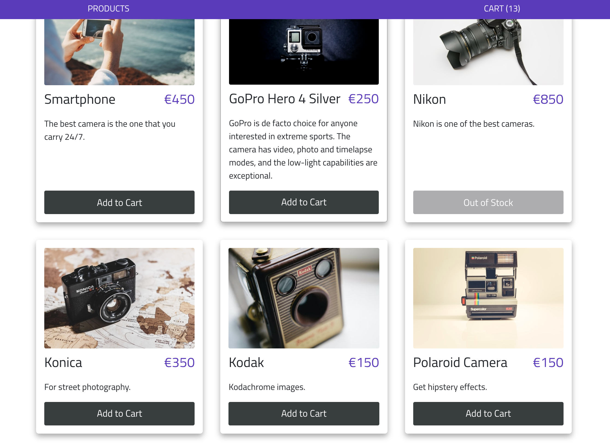

## Start the app

In the project directory, you can run:

### `npm install`

## Overview

This is a basic Product Listing page and a Shopping Cart page built with Vue.js.

## Features

- Display a list of products from the provided file
- Add items to the cart
- Remove items from the cart
- Display the number of items in the cart
- Display the total price of the items in the cart
- Display the total price for each group of items in the cart based on quantity
- Change “Add To Cart” button caption to “Sold Out” and disable it when inventory is depleted

## Technologies

- HTML
- CSS
- JavaScript
- Bootstrap 4
- Vue.js
- Node.js
- Express

## Preview

Products Listing

Cart

## Roadmap

Solve known bugs
